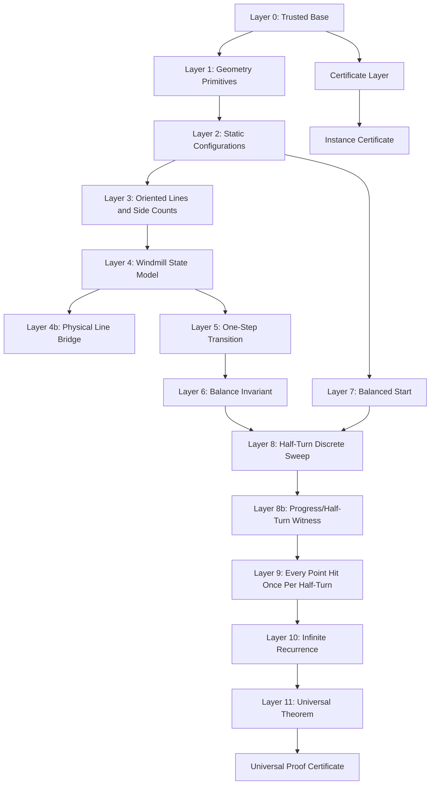

# Universal Windmill Proof Plan

This document breaks the universal Lean proof into layers and components.

The goal is to avoid proving the theorem in one large jump. Each layer should expose small Lean definitions and theorems that can be checked independently, with no `sorry`, `admit`, custom `axiom`, or `unsafe`.

## Target Theorem

For every finite set of at least two points in the plane, with no three collinear, there exists an initial windmill line and pivot such that every point is used as a pivot infinitely often.

In Lean, this should eventually become:

```lean
theorem windmill_universal :
  -- finite point set, general position
  -- exists initial state
  -- forall point p and time bound N, exists k >= N with pivot k = p
```

The exact statement should be finalized after the model layer is chosen.

The theorem has two structural cases:

- `n = 2`: the windmill alternates between the two points. This should be a small base case.
- `n >= 3`: the usual next-pivot state model applies.

## Flowchart



## Layer 0: Trusted Base

Purpose: Keep the project honest while proof work is incomplete.

Components:

- `Windmill/Certificate.lean`: finite certificate checker.
- `Windmill/Generated.lean`: one exported certificate.
- `Windmill/Soundness.lean`: generic consequences of `check = true`.
- `scripts/audit_lean.py`: rejects trust holes in trusted Lean sources.

Exit criteria:

- `lake build` passes.
- `python3 scripts/audit_lean.py` passes.
- `#print axioms` for trusted final theorems contains no `sorryAx`.

## Layer 1: Geometry Primitives

Purpose: Give Lean exact algebraic predicates for plane geometry.

Status: started in `Windmill/Universal/Primitives.lean` using integer coordinates, and restarted for the final theorem in `Windmill/Real/Primitives.lean` using Mathlib and real coordinates.

Definitions:

- `Point`
- vector subtraction
- cross product
- signed orientation
- collinearity

Core lemmas:

- orientation antisymmetry
- orientation cyclicity
- non-collinearity implies nonzero orientation
- side sign flips when line direction is reversed

Notes:

- Keep the integer layer for exact certificates and order-type experiments.
- Use `Windmill.Real` for the final arbitrary real-plane theorem.

## Layer 2: Static Configurations

Purpose: Formalize finite point sets in general position.

Status: started in `Windmill/Universal/Config.lean` and `Windmill/Real/Config.lean`; the real layer now has a separating-direction theorem in `Windmill/Real/Projection.lean`.

Definitions:

- `PointConfig n`
- `GeneralPosition`
- distinct points
- no three collinear

Core lemmas:

- every two distinct indices define a nonzero line direction
- every third point has a strict side relative to that line
- finite index set has decidable equality and finite cardinality

## Layer 3: Oriented Lines and Side Counts

Purpose: Convert geometry into the combinatorial invariant.

Status: side predicates and reversal lemmas started in `Windmill/Universal/Side.lean`; side-index lists/counts are now started in `Windmill/Universal/SideCount.lean`, `Windmill/Real/Side.lean`, and `Windmill/Real/Balance.lean`.

Definitions:

- `Side := left | right`
- `sideOf line point`
- `leftCount`
- `rightCount`
- `balanced`

Core lemmas:

- excluded pivot is not counted
- in general position every non-line point is left or right
- `leftCount + rightCount = n - 1` for a line through one pivot
- or `leftCount + rightCount = n - 2` for a line through two point indices, depending on chosen state model
- reversing orientation swaps left and right

Design decision:

- The original windmill line is an unoriented geometric line plus a rotation direction.
- The invariant is easiest with an oriented line.
- We need one canonical translation between those views.

## Layer 4: Windmill State Model

Purpose: Choose the discrete Lean object that represents a continuous windmill just after a pivot switch.

Current real state:

```lean
structure WState (n : Nat) where
  prev : Fin n
  curr : Fin n
  prev_ne_curr : prev != curr
```

Meaning:

- the current pivot is `curr`
- the current line passes through `prev` and `curr`
- the state ray is represented by the directed line from `curr` to `prev`

Core obligations:

- state represents a valid physical windmill moment
- every physical pivot switch corresponds to one `WState` transition
- every `WState` transition corresponds to the physical next pivot

## Layer 4b: Physical Line Bridge

Purpose: Prevent proving a nearby discrete theorem instead of the original IMO statement.

The original theorem chooses an initial pivot and an initial line through that pivot. The ordered-pair state model instead represents a moment just after the line has hit another point.

Bridge components:

- define a physical windmill line state: pivot plus line direction plus rotation direction
- define when a physical state is represented by a `WState`
- prove that a balanced physical start can be advanced to a represented `WState`
- prove that infinite pivot visits in the `WState` orbit imply infinite pivot visits in the original physical process

Target lemma:

```lean
theorem physical_state_bridge :
  -- physical windmill process represented by WState orbit
```

## Layer 5: One-Step Transition

Purpose: Define and prove the next pivot exists and is unique.

Definitions:

- angular order around current pivot
- open arc between current line and candidate next line
- `IsNextPivot`
- `nextPivot`
- `step : WState n -> WState n`

Status: `Windmill/Real/Arc.lean` and `Windmill/Real/Step.lean` now contain the open-arc and next-pivot witness scaffolding. Existence and uniqueness are not yet proved.

Core lemmas:

- candidate set is nonempty for `n >= 3`
- angular minimum exists
- uniqueness follows from no three collinear
- transition excludes simultaneous hits

Known source:

- Aristotle's `Defs.lean`, `Angular.lean`, and `Step.lean` may contain useful scaffolding, but must be reviewed before merge.

## Layer 6: Balance Invariant

Purpose: Prove the local invariant at a pivot switch.

Human statement:

When the rotating line moves from pivot `P` and next hits `Q`, the point `Q` leaves one side count, and the old pivot `P` enters the same side count after the switch. All other points keep their side.

Formal components:

- classify points other than `P` and `Q`
- prove non-pivot points do not cross during the open rotation interval
- prove old pivot and new pivot exchange roles
- prove the count equality

Target lemma shape:

```lean
theorem balance_invariant_one_step :
  balanced config state ->
  balanced config (step state)
```

or stronger:

```lean
theorem side_count_invariant_one_step :
  sideBalance config state = sideBalance config (step state)
```

This is the first hard theorem.

## Layer 7: Balanced Start

Purpose: Prove a balanced initial state exists.

Preferred proof route:

- choose a direction whose projections of all points are distinct
- order points by projection onto the perpendicular axis
- choose the median point or median gap
- the line through the median point in the chosen direction has equal side counts in the odd case, or near-equal counts in the even case

Core components:

- projection function
- finite ordering by projection
- existence of a direction avoiding equal projections
- median index lemma
- convert projection order into side count

Target lemma:

```lean
theorem exists_balanced_start :
  GeneralPosition config ->
  exists state, balanced config state
```

This should avoid the invalid shortcut `leftCount(A,B) + leftCount(B,A) = n - 2`.

Status: proved for real configurations as `Windmill.Real.balanced_start_exists`, stated as existence of a physically balanced line through one pivot. The state-level bridge from physical starts to post-switch states remains separate.

## Layer 8: Half-Turn Discrete Sweep

Purpose: Replace continuous rotation language with a discrete sequence statement.

Human statement:

After the windmill line rotates by 180 degrees, the geometric line is the same but the oriented sides have swapped.

Formal components:

- define accumulated angular progress, or avoid real angles by proving a finite cyclic-order statement
- identify the first time the line direction has advanced by a half-turn
- show every point whose side changes must have been hit as a pivot during that interval
- show balanced invariant persists through the interval

Design choice:

- Angle-based route: closer to the video proof, but requires real-angle formalization.
- Cyclic-order route: more combinatorial, likely better for Lean, but requires more order-type infrastructure.

This layer needs a real progress object. Finite periodicity plus balance is not enough. The proof must know that the windmill has advanced through a half-turn or through the equivalent cyclic-order interval.

## Layer 8b: Progress/Half-Turn Witness

Purpose: Make "after 180 degrees" into a discrete Lean object.

Candidate encodings:

- accumulated angle, if using `Real`/Mathlib
- number of crossed directions in a cyclic order, if using an order-type approach
- a finite interval of states whose final represented oriented line is the reversal of the initial represented line

Required theorem shape:

```lean
theorem exists_half_turn_interval :
  -- from any state, there is a finite later state whose oriented line is reversed
```

This theorem is a prerequisite for coverage. Without it, a periodic balanced orbit may be formally periodic without proving the geometric side-swap needed by the IMO proof.

## Layer 9: Every Point Hit Once Per Half-Turn

Purpose: Convert side-swap plus invariant into coverage.

Human statement:

If a point were never hit during a half-turn, it would stay on the same side. But all points must swap sides after a half-turn. Therefore every point is hit.

Formal components:

- point not hit implies side is constant through every step
- half-turn implies side is reversed
- contradiction

Target lemma:

```lean
theorem coverage_in_half_turn :
  balanced config state ->
  every point appears as curr in the interval before halfTurn state
```

This is the second hard theorem.

## Layer 10: Infinite Recurrence

Purpose: Turn repeated half-turn coverage into infinitely many pivot hits.

Components:

- define repeated intervals
- each interval covers all points
- for every bound `N`, choose a later interval

Target lemma:

```lean
theorem infinitely_often :
  balanced config state ->
  forall p N, exists k >= N, pivotAt k = p
```

This should be easier once Layer 9 exists.

## Layer 11: Universal Theorem

Purpose: Assemble the proof.

Dependencies:

- Layer 4 faithful model
- Layer 6 invariant
- Layer 7 balanced start
- Layer 10 infinite recurrence

Final checks:

- no `sorry`
- no custom `axiom`
- `#print axioms windmill_universal` does not include `sorryAx`
- executable finite certificate layer still builds

## Certificate Layer

There are two certificates with different meanings.

Instance certificate:

- concrete point set
- concrete cycle
- concrete cover witnesses
- verified by `Windmill.Generated.exported_valid`
- soundness exposed by `Windmill.Soundness`

Universal proof certificate:

- the Lean theorem object for `windmill_universal`
- verified by `lake build`
- audited with `#print axioms`

The universal proof certificate cannot be generated until Layers 1-11 are complete.

## Suggested Implementation Order

1. Keep `Windmill/Certificate.lean`, `Windmill/Generated.lean`, and `Windmill/Soundness.lean` as trusted baseline.
2. Make the trust-hole audit recursive before adding `Windmill/Universal/`.
3. Add the `n = 2` base case explicitly. Started in `Windmill/Universal/TwoPoint.lean`.
4. Create a separate namespace or folder for universal proof work, such as `Windmill/Universal/`.
5. Implement Layer 1 and Layer 2 with small algebraic lemmas.
6. Implement Layer 3 and settle the state model decision.
7. Add Layer 4b before claiming the final theorem matches the original problem.
8. Port only the useful non-`sorry` parts of Aristotle's step model after review, rewritten under `Windmill.Real`.
9. Attack Layer 7 before Layer 6 because the median-line proof is more isolated. Done in the real layer.
10. Prove Step existence and uniqueness in `Windmill.Real`.
11. Attack Layer 6 one-step invariant.
12. Attack Layer 8, Layer 8b, and Layer 9 together, choosing either angle or cyclic-order encoding.
13. Assemble Layer 10 and Layer 11.
